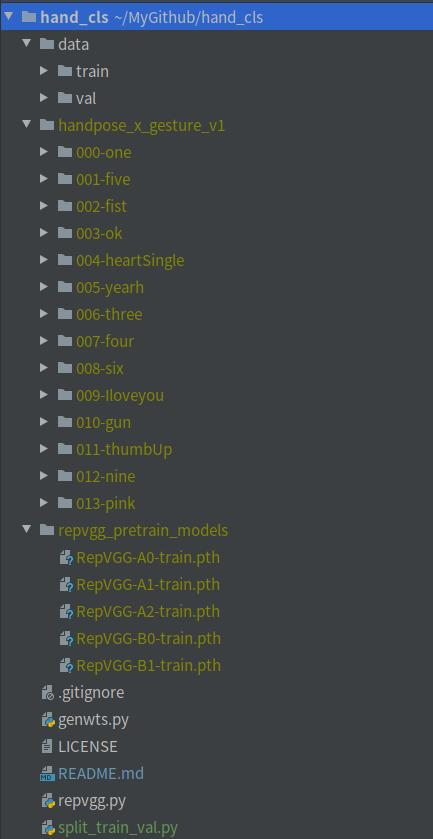

# hand_cls
A hand classification using repvgg.

### 下载数据集和预训练模型
新建repvgg_pretrain_models文件夹, 预训练模型放在其中

https://github.com/DingXiaoH/RepVGG 

https://pan.baidu.com/share/init?surl=nCsZlMynnJwbUBKn0ch7dQ ,the access code is "rvgg"

数据集

https://gitcode.net/EricLee/classification

https://pan.baidu.com/s/1Sd-Ad88Wzp0qjGH6Ngah0g#list/path=%2F

### 切分数据集
`python split_train_val.py`

### 训练
可选模型 "RepVGG-A0", "RepVGG-A1", "RepVGG-A2", "RepVGG-B0", "RepVGG-B1", "RepVGG-B2"

`python train.py data -a RepVGG-A0`

### 生成wts
`python genwts.py`

### 测试
`python test.py`